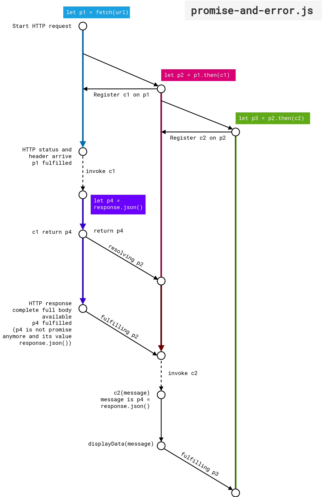

# Asynchronous Programming in JavaScript

This topic about asynchronous will be divided into two parts.
The first part is discussing that asynchronous programming is main feature in 
JavaScript programming langauage and also short introuction to a Promise object

In the second part, we will see more closely to the Promise object and the use
of await expression and async function.

Di tahap pertama ini kita akan membahas dua hal berikut:
- Mengenal pemrograman asinkronus    
- Contoh program asinkronus sederhana

## Understanding the principle of asynchronous programming
Sebelum mengerti asinkronus, kita harus mengerti bahwa pemroograman sinkronus
adalah semua progran yang telah kita pelajari di bagian sebelumnya
yaitu saat setiap perintah-perintah (statements) dieksekusi secara berurutan, 
setiap perintah akan dieksekusi setelah perintah yang dipanggil (umumnya di baris
sebelumnya) telah selesai dijalankan.

Program asinkronus merupakan program yang dapat berjalan tanpa harus menunggu
program lain selesai melakukan proses eksekusinya. Misal ada dua program 
yang satu melakukan download lagu, dan yang lain memutar file MP3. Atau 
saat kalian membuka aplikasi Instagram, kalian juga menerima notifikasi pesan 
masuk dari aplikasi WhatsApp. Bisa dikatakan
hampir semua aplikasi yang ada di laptop/PC atau *smartphone* yang kita 
gunakan berbasis pada pemrograman asinkronus.

Detail pemrograman asinkronus ini bekerja pada level prosesor bukanlah 
menjadi persoalan yang kita harus pelajari. Namun tata cara menggunakan
fitur pemrograman asinkronus di JavaScript adalah yang sangat perlu kita pelajari.

Berikut sedikit ilustrasi perbandingan pemrograman sinkronus dan 
asinkronus menurut (Haverbeke, 2018)


Dari gambar di atas terdapat istilah *threads* yang merupakan potongan
kode yang dijalankan pada suatu proses dalam suatu prosesor. Prosesor 
menjalankan proses besar yang terdiri dari beberapa *threads*. Seperti
sistem operasi merupakan proses besar yang terdiri dari potongan program
program kecil untuk mengatur hubungan antara *hardware* di dalam komputer 
dan sistem I/O 
(input/output termasuk monitor, keyboard, dan mouse)

Program-program yang kita buat di dalam Node.js dijalankan oleh *thread* ini.

Garis biru menunjukkan perjalanan waktu saat suatu program dieksekusi.
Garis merah adalah ketika program melakukan suatu *request* ke server.
Ketika kita menggunakan pemrograman sinkronus, kita harus menunggu program
pertama selesai melakukan *request*, baru kita bisa menjalankan program kedua.

Jika kita lakukan dengan dua *threads*, kita tidak bisa mengkomunikasikan
antara dua program ini misal program kedua akan melakukan instruksi kedua
(setelah program kedua melakukan *request*).

Namun dengan asinkronus, kita bisa membuat dua-duanya berjalan beriringan.
Dan ketika program pertama selesai melakukan *request* maka instruksi program
kedua bisa langsung dijalankan tanpa perlu melakukan *request* oleh program kedua
ini.

Bisa dikatakan, program pertama tetap berjalan di *background* sembari
kita bisa menjalankan program kedua. Kemampuan seperti ini sangatlah diperlukan
misal kita ingin menunggu input dari user dan melakukan suatu aksi ketika user
melakukan suatu input ke dalam program kita. Mirip seperti while loop
yang akan terhenti jika ada user input namun kita disini membiarkan 
program pertama terus berjalan.

## An example of asynchronous program

Berikut ini adalah program yang menunjukkan penggunaan pemrograman asinkronus.
Terdapat istilah fungsi *callback* yang artinya fungsi ini akan menjadi suatu
argument untuk fungsi lain (sebut *parent* function). *Parent* function
ini akan berjalan di *background* (tetap dieksekusi) sampai suatu
*event* terjadi yang mengakibatkan fungsi *callback* dieksekusi atau 
lebih tepatnya dipanggil (*invoking*).

Pada program pertama ini, fungsi `setTimeout()` memerlukan dua input
argument. Pertama adalah *callback function* yang akan dipanggil setelah
jeda (*delay*) waktu pada input argument kedua selesai.
Pada contoh ini kita menginputkan argument *delay* sebanyak 2 detik. 
Input argument ini bersatuan *millisecond*, jadi kita inputkan 2 detik
sebagai 2,000 *milliseconds*.     

**timer-set-timeout.js**
```js
// Only run once after put a delay of 2 secons

console.log("delay two seconds from now");

const callbackFunc = () => {console.log("run after two seconds")};
setTimeout(callbackFunc, 2_000);
console.log("Do something during 2 secs");
```

Program kedua kita memiliki *nested callback function*. Artinya
*Callback function* di dalam *callback function* di dalam *callback function*,
dan seterusnya. Di program kedua ini, `callbackFunc()` merupakan 
*callback function* untuk `setInterval()` dan variable `updateInterval()`
yang merupakan referensi ke fungsi `setInterval()` menjadi bagian dari
*callback function* `stop_callbackFunc()`.
Dan terakhir `stop_callbackFunc()` merupakan argument fungsi `setTimeout()`.

**timer-set-interval.js**
```js
// The following program will print sequentially
// numbers from 1 to 10 with each one second delay

let state = {num: 0}

let callbackFunc = () => {
  state.num += 1;
  console.log(state.num)};

// Call callbackFunc in one second and then again repeat
// every second after that
let updateIntervalId = setInterval(callbackFunc, 1_000);


// setInterval() returns a value that we can use to stop the
// repeated invocations by calling clearInterval()

function stop_callbackFunc() {
  clearInterval(updateIntervalId);
}

setTimeout(stop_callbackFunc, 10_500);   // add a little bit milliseconds
                                         // from 10 secs.

```
Kita lihat disini kerumitan yang ditimbulkan dengan alur penggunaan  
*callback function* yang saling berkaitan. Kita akan melihat di 
bagian kedua bahwa hal ini dapat kita sederhanakan dan penulisan program
menjadi lebih elegan menggunakan objek *Promise*.


<br/>

Untuk contoh terakhir, program terdiri dari tiga berkas yaitu 
`events-demo.html`, `events-demo.css`, dan `events-demo.js`.
Program ini akan memberikan kita tampilan di berkas `.html`
berupa tombol untuk mengubah-ubah warna suatu teks.

Buat suatu folder bernama *events* dan taruh ketiga berkas tersebut
(`.html`, `.css`, dan `.js`) dalam folder tersebut.

**events-demo.html**
```html
<html>
  <head>
    <link rel="stylesheet" href="./events-demo.css"></style>
  </head>
  <body>
    <div id="output">
      <h3>Hello world!</h3>
    </div>
    <button id="change">Change color</button>

    <script src="./events-demo.js"></script>
  </body>
</html> 
```


**events-demo.css**
```css
.red {
  color: red;
}

.green {
  color: green;
}
```


**events-demo.js**
```js
function changeColor() {
  outElement = document.getElementById("output");
  // console.log(outElement.className);
  
  let currentClass = outElement.className;
  if (currentClass === "" || currentClass === "green") {
    outElement.className = "red";
  } else { 
    outElement.className = "green";
  } 
}

let btnChange = document.getElementById("change");

btnChange.addEventListener("click", changeColor);
```


## Introduction to Promise object

Objek Promise, adalah suatu objek khusus yang menangani manajemen fungsi
yang memiliki perilaku asinkronus. Perilaku asinkronus disini artinya
fungsi tersebut dapat dijalankan secara asinkronus yang artinya 
memberikan fitur *non-blocking* terhadap fungsi lain atau program lain 
yang dijalankan (ingat kembali terkait program **timer-set-timeout.js**).

Apabila kita menuliskan program asinkronus menggunakan callback function,
maka kita memiliki masalah banyaknya nested function ketika
kita membuat program asinkronus dengan jumlah fungsi asinkronus cukup
banyak dan membuat program kita nampak tidak terstuktur. Promise
object mampu menangani ini.

Cara mengubah dari program asinkronus yang menggunakan callback function
adalah dengan mengganti susunan callback function tersebut dengan 
method `.then(callbackFunc)` yang tersedia dalam Promise object

Sintaks dari penulisan Promise object:
```js
p1(arg1)
  .then(callbackFunc1)
  .then(callbackFunc2)
  .catch(callbackErrorHandler)
```

Makna dari program tersebut adalah `p1` adalah suat fungsi yang menghasilkan
atau memberikan nilai return Promise object. Jika eksekusi Promise 
object ini selesai (disebut **settled**) maka akan ada dua kemungkinan
Ekseksui fungsi `p1` menghasilkan nilai return yang diinginkan (disebut
**fulfilled**) atau fungsi `p1` mengalami error ditengah ekseksi
(disebut **rejected**). Jika fungsi `p1` berada di *state* **fulfilled**, 
maka `callbackFunc1` dijalankan.. Dan pemanggilan `callbackFunc1` dilakukan
dan memberikan hasil berupa Promise object.
Proses ini terus dilanjutkan sama seperti proses eksekusi fungsi `p1`,
hingga kita berhasil memanggil `callbackFunc2`. Namun jika selama proses
eksekusi di atas terjadi error atau Promise object berada di keadaan
**rejected**, maka perintah `callbackErrorHandler` yang akan dijalankan.

Promise object juga mampu memberikan aliran program seperti air yang
mengalir dari anak tangga menuju anak tangga berikutnya. Tiap-tiap
anak tangga ini adalah kombinasi methods `.then()` dan `.catch()` 
(bisa juga menambahkan `.finally()` namun disini kita cukup menggunakan 
`.then()` dan `.catch()`).


## Some practical use of Promise object

Berikut contoh program asinkronus yang menggunakan struktur
Promise object yang ditulis 
menggunakan `.then()`

Pada program ini kita menggunakan restcountry API yang menyediakan
beberapa data-data umum terkait negara-negara di dunia. Dan kita
akan mencetak GINI indeks untup tiap negara.

**promise-and-error-restcountryAPI.js**
```js
// Fetch A JSON api to demonstrate .catch

function displayData(message) {
  
  for (let country of message) {
    if (country.gini) {
      console.log(country.name.common, country.gini);
    }
  }

}

function c1(response) {
  if (!response.ok) {
    return null;
  }

  console.log(response.status)
  
  // Now check the headers to ensure that the server sent us JSON
  // If not, the server is broken.
  let type = response.headers.get('content-type');
  console.log(type);

  if (type !== "application/json") {
    throw new TypeError(`Expected JSON, got ${type}`);
  }

  // If we get here, then we got a 2xx status and a JSON content-type
  // so we confidently return a Promise for the response body as a JSON object
  let p4 = response.json();
  console.log(p4);
  return p4; 
}

function c2(message) {
  if (message) {
    displayData(message);
  }
  else {
    console.log("Message is null or undefined");
  }
}

function c3(err) {
  if (err instanceof TypeError) {
    // This happens if we throw TypeError above
    console.log("Something is wrong with the server");
  }
  else {
    // This must be some kind of unanticipated error
    console.error(err);
  }
}

// https://gitlab.com/restcountries/restcountries
const url = "https://restcountries.com/v3.1/all"

console.log(url);

let p1 = fetch(url)
  .then(c1)
  .then(c2)
  .catch(c3);
```

Perhatikan contoh di atas bahwa program mulai dijalankan 
dari bagian `let p1 = fetch(url)` dan Promise object akan diteruskan
ke pemanggilan callback `.then(c1)` 
berikutnya ke pemanggilan callback `.then(c2)`.
Apabila terjadi error di tengah jalan, callback `c3` akan dipanggil.

Diagram waktu untuk proses ini cukup rumit, namun dapat
digambarkan sebagai berikut. Pada pertemuan kuliah akan dijelaskan 
kembali.




## `await` and `async`

Merupakan dua buah _keyword_ yang cukup penting dan akan sering dijumpai
ketika bekerja dengan program JavaScript yang memiliki fitur
interaktif artinya ada interaksi antara user dengan aplikasi atau _trigger_ lain 
yang mengakibatkan suatu proses dijalankan. 

_Keyword_ pertama yaitu `await` digunakan supaya suatu keadaan di  
Promise object menjadi keadaan *settled*.
Di dalam Promise object dikenal tiga macam keadaan yaitu:

- _pending_: Suatu objek Promise yang sedang dalam proses eksekusi.
- _fulfilled_: Suatu objek Promise yang telah menyelesaikan eksekusinya dan 
               telah memberikan suatu _output_ nilai.
- _rejected_: Suatu objek Promise yang mengalami suatu _error_ atau masalah di 
              dalam proses eksekusinya, sehingga akan memberikan nilai _output_ 
              berupa objek _error_.

Selain tiga macam keadaan tersebut, ada beberapa tambahan istilah yang sering  
digunakan dalam objek Promise: 
- _settled_: Suatu objek Promise yang berada pada keadaan _fulfilled_ atau 
             _rejected_.
 - _resolved_: Suatu objek Promise yang berada pada keadaan _pending_ dan
 keadaan _settled_ atau tidaknya dipengaruhi oleh objek Promise lain berada
 pada keadaan _settled_ atau tidak. 

Ke-empat istilah di dalam objek Promise tersebut lebih mudah dimengerti dengan   
diagram berikut   


Untuk _resolved_, silahkan dilihat pada gambar sebelumnya.

Keyword kedua adalah `async`. Keyword ini adalah pelengkap dari penggunaan
keyword `await`. Karena dalam aturan penggunaan `await`, apabila
`await` digunakan di dalam deklarasi atau _body of function_ suatu fungsi lain (
kita sebut fungsi lain ini fungsi _parent_),
maka fungsi *parent* tersebut harus di-set supaya menjadi fungsi asinkronus 
dengan cara menambahkan `async` keyword di depan deklarasi fungsi _parent_ 
tersebut. 

Berikut contoh penggunaan `await` dan `async`. Kita lihat fungsi `fetchData()` 
dan `main()` memuat keywords `await` di dalam _body of function_ (`await delay(2000)` 
dan `await fetchData()` berturut-turut). Secara aturan kedua fungsi _parents_
ini harus di awali `async` keyword supaya berjalan sebagaimana mestinya.

**await-and-async.js**
```js
// A function that simulates an asynchronous operation with a delay
function delay(ms) {
  return new Promise((resolve) => setTimeout(resolve, ms));
}

// An asynchronous function that uses the "await" keyword
async function fetchData() {
  console.log("Fetching data...");
  await delay(2000); // Simulating a delay of 2 seconds
  console.log("Data fetched!");
  return { message: "Hello, World!" };
}

// Using the "await" keyword to wait for the asynchronous function to complete
async function main() {
  console.log("Start");
  const result = await fetchData();
  console.log(result.message);
  console.log("End");
}

// Calling the main function
main();
```

Dari contoh di atas, apabila keyword `async` dan `await` dihilangkan maka 
`delay(2000)` akan dijalankan di tahapan terakhir.


## Exercises {-}
1. Bacalah topik mengenai pemrograman asinkronus di dalam 
   buku [(Haverbeke, 2018) - Bab 11](https://eloquentjavascript.net/11_async.html). 
   Jelaskan dan gambarkan keterkaitan hal apa saja yang telah kalian pahami
   di subbab *Asynchronicity*, *Crow Tech*, dan *Callbacks*. 
   Catatan: Jawaban setiap
   mahasiswa harus berbeda. Jawaban yang sama akan dibagi ke jumlah mahasiswa
   yang menjawab jawaban sama persis

2. Pelajari penggunaan Web API fetch dari blog berikut: 
   [JavaScript fetch API Ultimate Guide](https://blog.webdevsimplified.com/2022-01/js-fetch-api/)
   Tuliskan hal yang kalian benar-benar pahami.
   Dan tuliskan juga hal yang belum bisa kalian pahami dari tulisan dalam
   *blog* tersebut.

3. Bacalah dengan seksama kembali pertemuan ini
   dan tuliskan kembali dengan menggunakan bahasa yang kalian pahami 
   terkait Promise, async, dan await. Hanya tulis yang kalian benar-benar pahami. 
   Bisa juga kalian menanbahkan hasil eksplorasi dari internet
   jika diperlukan untuk memperjelas apa yang kalian tulis.
   Jawaban yang sama akan dibagi dengan jumlah mahasiswa yang memiliki 
   jawaban sama.

2. Susunlah suatu program menggunakan Promise object
   dan fungsi `fetch` dan *package* `node-html-parser` untuk 
   melakukan *scraping* nama *heroes* dalam *game Mobile Legends*
   dan pasangan URL untuk masing-masing *hero*.
   *Scraping* dimulai dilakukan dari laman berikut:
   `https://mobile-legends.fandom.com/wiki/List_of_heroes`

   Jika program yang dibuat benar, maka akan ditampilkan hasil
   seperti berikut di layar `console` VSCode.
   ```bash
   Miya        https://mobile-legends.fandom.com/wiki/Miya
   Balmond     https://mobile-legends.fandom.com/wiki/Balmond
   Saber       https://mobile-legends.fandom.com/wiki/Saber
   # dan seterusnya sampai semua list heroes tercetak
   ```
